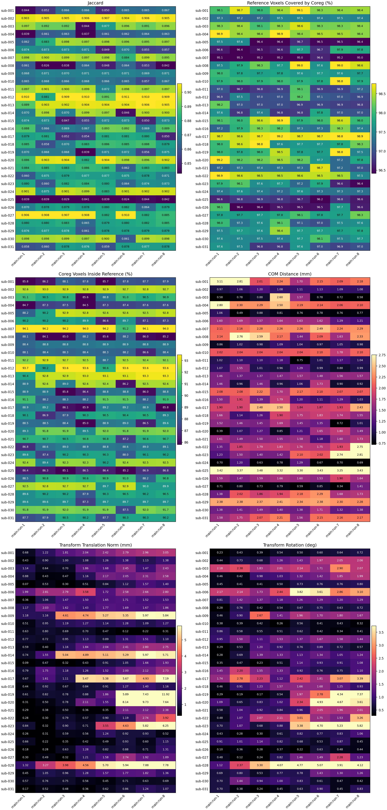
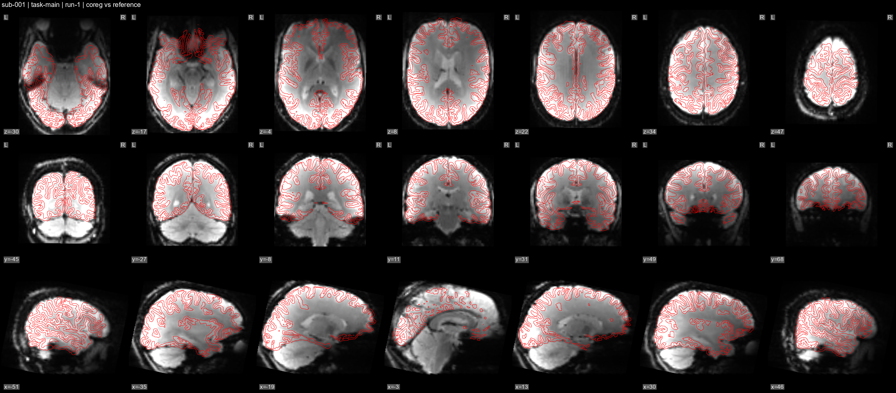

# Registration QC

`fmri_utils.registration_qc` provides a manifest-driven registration QC utility for aligned reference/coreg image pairs.
It writes quantitative run/subject heatmaps and optional two-frame APNGs that alternate between the coregistered image and the reference image.

## Manifest Schema

Required columns:
- `subject_id`
- `task`
- `run_label`
- `reference_img_path`
- `coreg_img_path`
- `reference_mask_path`
- `coreg_mask_path`

Optional columns:
- `affine_transform_path`
- `segmentation_mask_path`
- `source_label`

Notes:
- Inputs can be on different voxel grids; by default the utility resamples coreg inputs to the reference grid.
- For highest-resolution APNGs, use a high-resolution anatomical image as `reference_img_path`; lower-resolution functional/coreg images will be resampled to that grid for display.
- Masks must be non-empty binary-like images (`>0` treated as mask).
- APNG plane display preserves physical voxel-size aspect ratios. This matters for anisotropic anatomical images, e.g. `0.5 x 0.8 x 0.5 mm`.
- The optional segmentation is used only for APNG contours:
  - Binary segmentation/ribbon masks are contoured as-is.
  - Label maps are treated as fMRIPrep-like dseg images when label `3` is present, and only label `3` is contoured.
  - Prefer fMRIPrep `desc-ribbon_mask` when available for fine cortical contours.

## CLI

For generic manifest-driven QC:

```bash
fmri-registration-qc \
  --manifest-csv /path/to/manifest.csv \
  --out-dir /path/to/output
```

Optional flags:
- `--skip-apng`
- `--apng-duration-ms 1200`
- `--slices 7`
- `--crop-margin-px 8`
- `--apng-tile-scale 1`
- `--font-size 18`
- `--no-overview-heatmap`
- `--overview-heatmap-name overview_heatmap.png`

Use `--apng-tile-scale` only when you intentionally want to enlarge a low-resolution grid. It does not add real resolution; for clean contours, render on the highest-resolution appropriate reference grid instead.

To build a manifest directly from fMRIPrep BOLDref/T1w outputs:

```bash
fmri-registration-qc-manifest \
  --fmriprep-root /path/to/fmriprep \
  --out-csv /path/to/registration_qc_manifest.csv \
  --segmentation-source ribbon_or_dseg
```

Then run QC:

```bash
fmri-registration-qc \
  --manifest-csv /path/to/registration_qc_manifest.csv \
  --out-dir /path/to/registration_qc_outputs \
  --slices 7 \
  --crop-margin-px 12
```

## Python API

```python
from fmri_utils.registration_qc import RegistrationQcConfig, run_registration_qc

summary = run_registration_qc(
    manifest="/path/to/manifest.csv",
    out_dir="/path/to/output",
    config=RegistrationQcConfig(
        apng_enabled=True,
        apng_duration_ms=1200,
        n_slices=7,
        crop_margin_px=8,
        apng_tile_scale=1,
    ),
)
print(summary["outputs"]["run_metrics_csv"])
```

## Recommended fMRIPrep Setup

For BOLDref-to-T1w QC, a good manifest uses:

- `reference_img_path`: `sub-*_desc-preproc_T1w.nii.gz`
- `coreg_img_path`: `sub-*_space-T1w_boldref.nii.gz`
- `reference_mask_path`: `sub-*_desc-brain_mask.nii.gz`
- `coreg_mask_path`: `sub-*_space-T1w_desc-brain_mask.nii.gz`
- `segmentation_mask_path`: preferably `sub-*_desc-ribbon_mask.nii.gz`, falling back to `sub-*_dseg.nii.gz`

This renders the APNG on the T1w grid. That is slower than rendering on the functional grid, but it avoids blurry upsampled APNGs and gives the best contour quality.

## Concrete Example

```bash
fmri-registration-qc-manifest \
  --fmriprep-root D:/Datasets/3DfMRI/fmriprep/fmriprep \
  --out-csv D:/Datasets/3DfMRI/analysis/registration_qc/fmriprep_boldref_vs_t1/manifest.csv \
  --segmentation-source ribbon_or_dseg

fmri-registration-qc \
  --manifest-csv D:/Datasets/3DfMRI/analysis/registration_qc/fmriprep_boldref_vs_t1/manifest.csv \
  --out-dir D:/Datasets/3DfMRI/analysis/registration_qc/fmriprep_boldref_vs_t1/full_qc \
  --slices 7 \
  --crop-margin-px 12
```

Example outputs from a successful run:





## Outputs

Written under `out_dir`:
- `run_metrics.csv`
- `subject_metrics.csv`
- `qc_summary.json`
- `overview_heatmap.png` (single run-by-subject overview)
- `qualitative/apng/*.png` (two-frame APNG per run: coreg first, reference second)

## Metrics (v1)

Per run:
- `jaccard`
- `pct_reference_covered_by_coreg_mask`
- `pct_coreg_mask_within_reference`
- `com_distance_mm`
- optional transform diagnostics from affine:
  - `transform_translation_norm_mm`
  - `transform_rotation_deg`
