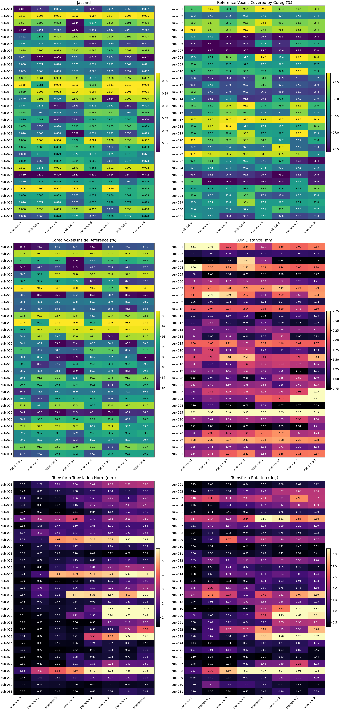
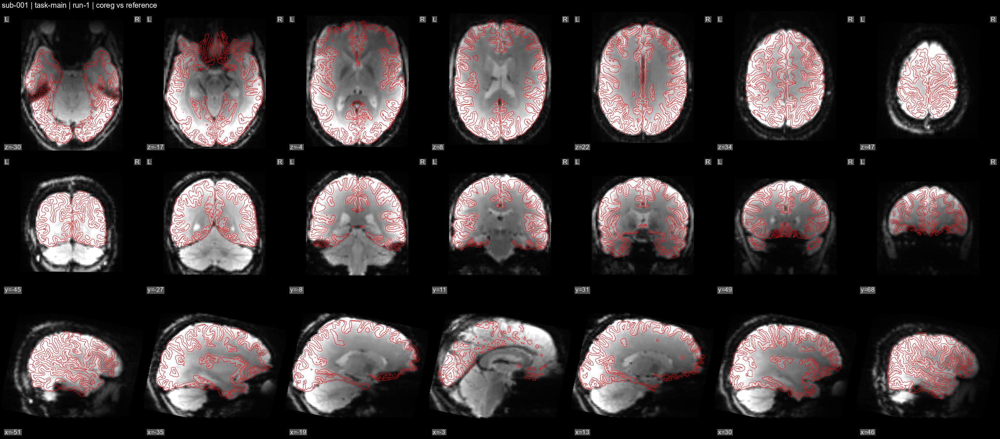

# Registration QC

`fmri_utils.registration_qc` provides a manifest-driven registration QC utility for aligned reference/coreg image pairs.
It writes quantitative run/subject heatmaps and optional two-frame APNGs that alternate between the coregistered image and the reference image.

## Manifest Schema

Required columns:
- `subject_id`
- `task`
- `run_label`
- `reference_img_path`
- `coreg_img_path`
- `reference_mask_path`
- `coreg_mask_path`

Optional columns:
- `affine_transform_path`
- `segmentation_mask_path`
- `source_label`
- `comparison_label`
- `quantitative_metrics_valid` (default `true`)

Notes:
- Inputs can be on different voxel grids; by default the utility resamples coreg inputs to the reference grid.
- For highest-resolution APNGs, use a high-resolution anatomical image as `reference_img_path`; lower-resolution functional/coreg images will be resampled to that grid for display.
- Masks must be non-empty binary-like images (`>0` treated as mask).
- Set `quantitative_metrics_valid=false` when masks are supplied only to define
  APNG crop/display support. The row is still rendered, but overlap and
  center-of-mass values are written as missing and excluded from summaries.
- APNG plane display preserves physical voxel-size aspect ratios. This matters for anisotropic anatomical images, e.g. `0.5 x 0.8 x 0.5 mm`.
- Slice locations and crop bounds are computed from the reference mask and reused for every run with the same subject, comparison, reference image, and reference mask. Runs therefore show exactly the same anatomical locations.
- The optional segmentation is used only for APNG contours:
  - Binary segmentation/ribbon masks are contoured as-is.
  - fMRIPrep-like dseg images use label `2` as the gray-matter ribbon. Contouring that ribbon draws both its inner gray/white boundary and its outer pial boundary.
  - Prefer fMRIPrep `desc-ribbon_mask` when available for fine cortical contours.

## CLI

For generic manifest-driven QC:

```bash
fmri-registration-qc \
  --manifest-csv /path/to/manifest.csv \
  --out-dir /path/to/output
```

Optional flags:
- `--skip-apng`
- `--reuse-existing-apng` (reuse valid two-frame APNGs while rebuilding metrics/reports)
- `--apng-duration-ms 1200`
- `--slices 7`
- `--crop-margin-px 8`
- `--apng-tile-scale 1`
- `--font-size 18`
- `--no-overview-heatmap`
- `--overview-heatmap-name overview_heatmap.png`

Use `--apng-tile-scale` only when you intentionally want to enlarge a low-resolution grid. It does not add real resolution; for clean contours, render on the highest-resolution appropriate reference grid instead.

To build the standard manifest directly from fMRIPrep outputs:

```bash
fmri-registration-qc-manifest \
  --fmriprep-root /path/to/fmriprep \
  --out-csv /path/to/registration_qc_manifest.csv \
  --segmentation-source ribbon_or_dseg
```

Then run QC:

```bash
fmri-registration-qc \
  --manifest-csv /path/to/registration_qc_manifest.csv \
  --out-dir /path/to/registration_qc_outputs \
  --slices 7 \
  --crop-margin-px 12
```

The standard manifest includes both:

- `func-to-T1w`: T1w-space BOLD reference versus the subject's preprocessed T1w image.
- `func-to-MNI`: MNI-space BOLD reference versus the matching `MNI152NLin2009cAsym` TemplateFlow T1w template.

The first MNI run may download the small TemplateFlow reference and brain-mask files. Use `--skip-mni` to generate only the legacy T1w comparison. An explicit local template can instead be supplied with both `--mni-reference-img` and `--mni-reference-mask`.
On a cluster, set `TEMPLATEFLOW_HOME` to a persistent project directory rather than a small home directory.

## Python API

```python
from fmri_utils.registration_qc import RegistrationQcConfig, run_registration_qc

summary = run_registration_qc(
    manifest="/path/to/manifest.csv",
    out_dir="/path/to/output",
    config=RegistrationQcConfig(
        apng_enabled=True,
        apng_duration_ms=1200,
        n_slices=7,
        crop_margin_px=8,
        apng_tile_scale=1,
    ),
)
print(summary["outputs"]["run_metrics_csv"])
```

## Recommended fMRIPrep Setup

For BOLDref-to-T1w QC, the generated manifest uses:

- `reference_img_path`: `sub-*_desc-preproc_T1w.nii.gz`
- `coreg_img_path`: `sub-*_space-T1w_boldref.nii.gz`
- `reference_mask_path`: `sub-*_desc-brain_mask.nii.gz`
- `coreg_mask_path`: `sub-*_space-T1w_desc-brain_mask.nii.gz`
- `segmentation_mask_path`: preferably `sub-*_desc-ribbon_mask.nii.gz`, falling back to `sub-*_dseg.nii.gz`

This renders the APNG on the T1w grid. That is slower than rendering on the functional grid, but it avoids blurry upsampled APNGs and gives the best contour quality.

For BOLDref-to-MNI QC, it uses:

- `reference_img_path`: TemplateFlow `MNI152NLin2009cAsym` brain-extracted T1w template.
- `coreg_img_path`: `sub-*_space-MNI152NLin2009cAsym_boldref.nii.gz`.
- `reference_mask_path`: the corresponding TemplateFlow brain mask.
- `coreg_mask_path`: `sub-*_space-MNI152NLin2009cAsym_desc-brain_mask.nii.gz`.
- `segmentation_mask_path`: the subject's MNI-space dseg when available.

## Concrete Example

```bash
fmri-registration-qc-manifest \
  --fmriprep-root D:/Datasets/3DfMRI/fmriprep/fmriprep \
  --out-csv D:/Datasets/3DfMRI/analysis/registration_qc/fmriprep_registration/manifest.csv \
  --segmentation-source ribbon_or_dseg

fmri-registration-qc \
  --manifest-csv D:/Datasets/3DfMRI/analysis/registration_qc/fmriprep_registration/manifest.csv \
  --out-dir D:/Datasets/3DfMRI/analysis/registration_qc/fmriprep_registration/full_qc \
  --slices 7 \
  --crop-margin-px 12
```

Example outputs from a successful run:





## Outputs

Written under `out_dir`:
- `run_metrics.csv`
- `subject_metrics.csv`
- `qc_summary.json`
- `overview_heatmap.png` (single run-by-subject overview)
- `qualitative/apng/func-to-T1w/*.png` (native anatomical registration APNGs)
- `qualitative/apng/func-to-MNI/*.png` (template registration APNGs)

Manually authored legacy manifests without `comparison_label` continue to write directly under `qualitative/apng/`.

## Metrics (v1)

Per run:
- `jaccard`
- `pct_reference_covered_by_coreg_mask`
- `pct_coreg_mask_within_reference`
- `com_distance_mm`
- optional transform diagnostics from affine:
  - `transform_translation_norm_mm`
  - `transform_rotation_deg`
